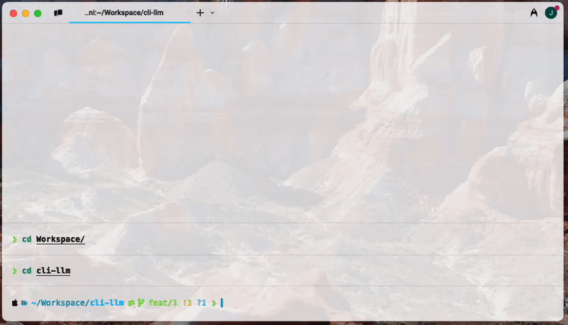

<div align='center'>
<h1>cli-llm</h1>

[](https://opensource.org/licenses/MIT)
</div>

> ***A boilerplate project designed to enhance LLM usability directly within your CLI.***



Stop context-switching and bring the power of LLMs to your terminal workflows. `cli-llm` provides a structured starting point to build personalized LLM tools tailored to your needs.

## About

Working in the terminal often involves repetitive text manipulation or generation tasks – asking, refining technical writing, formatting commit messages, and more. `cli-llm` aims to streamline these tasks by integrating LLM capabilities directly into your CLI environment.

Instead of copying text to a separate web UI or application, you can use pre-defined modes within `cli-llm` to instantly apply LLM processing to your input, keeping you focused and efficient.

## Features

* **Supercharge CLI Workflows:** Integrate LLM assistance without leaving your terminal.
* **Customizable Presets:** Easily define and switch between frequently used LLM interaction modes (e.g., question & answer, technical writing improvement, commit message generation). The included example demonstrates modes for:
    * Asking (`ask`)
    * Formal Writing (`writing`)
    * Commit Messages (`commit`)
* **Mode Persistence:** Stay in a specific interaction mode (like 'writing' or 'commit') for multiple messages until you explicitly switch.
* **DSPy Powered:** Leverages the DSPy framework for robust LLM interaction, allowing structured programming over simple prompting.
* **Boilerplate Structure:** Provides a clean foundation to add your own custom LLM-powered CLI features.

## Technology Stack

* **[DSPy](https://dspy.ai/):** The core framework for programming foundation models. It allows for structured interaction, optimization ("compilation"), and composability of LLM modules.
* **LLM Backend:** Configurable to use [various LLM providers](https://dspy.ai/learn/programming/language_models/) (e.g., Gemini, OpenAI, Anthropic) supported by DSPy via environment variables. The current example uses Gemini.

## Getting Started

Follow these steps to get a local copy up and running.

### Prerequisites

* [uv](https://docs.astral.sh/uv/getting-started/installation/) (Python package installer)


### Installation

1.  **Clone the repository (or download the files):**
    ```bash
    git clone https://github.com/jgkym/cli-llm  
    cd cli-llm
    ```
2.  **Install dependencies:**
    ```bash
    uv sync
    ```
    
3.  **Set up Environment Variables:**
    * Create a environment file:
        ```bash
        touch .env
        ```
    * Edit the `.env` file and add your API key(s). For the current example using Gemini: 
        ```dotenv
        # .env
        GEMINI_API_KEY=YOUR_API_KEY_HERE 
        ```
        *(Adapt variable names if using different providers/configurations in DSPy)*

## Usage

1.  **Run the main script:**
    ```bash
    python main.py
    ```
2.  **Select an initial mode:** Enter `1`, `2`, or `3` when prompted.
3.  **Enter your text:** Type or paste the text you want the LLM to process according to the current mode.
4.  **View the output:** The script will print the refined text, an explanation, and potentially suggestions.
5.  **Continue messaging:** Enter more text to process using the *same* mode.
6.  **Switch modes:** Enter `1`, `2`, or `3` at the prompt to change the active LLM processing mode.
7.  **Exit:** Press `Enter` on an empty line.

## Configuration

* **API Keys:** Managed via the `.env` file.
* **LLM Models:** Model names (e.g., `'gemini/gemini-2.5-flash-preview-04-17'`) are specified directly within the `main.py` script when initializing `dspy.LM`. You can change these to other models supported by your provider and DSPy.
* **DSPy Settings:** Temperature and other LM parameters are also set during `dspy.LM` initialization in `main.py`.

## Customization / Extending

Adding a new feature/mode is straightforward:

1.  **Define a Signature:** Create a new class inheriting from `dspy.Signature` in `main.py` (or a separate file) that defines the input and output fields for your new feature.
2.  **Create a Predictor:** Initialize a DSPy module (e.g., `dspy.ChainOfThought(YourNewSignature)`) in `main.py`.
3.  **Add Mode Mapping:** Assign a number to your new mode in the `mode_map` and `mode_descriptions` dictionaries in `main.py`.
4.  **Update Main Loop:** Add an `elif` condition in the `while True` loop in `main.py` to handle the new mode number, call your new predictor, and use `print_response` (or custom logic) to display the results.

## Contributing

Contributions are welcome! Please feel free to submit pull requests or open issues to suggest improvements or report bugs.

## License

Distributed under the MIT License. See `LICENSE` file for more information.